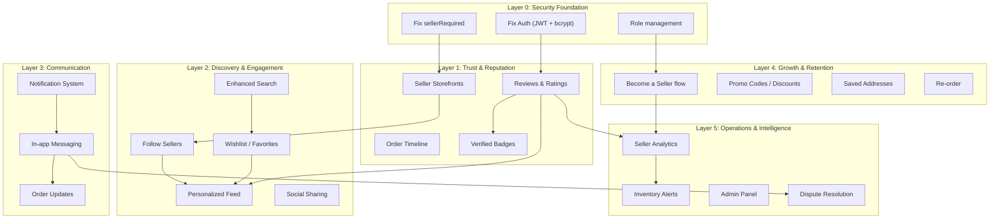

# MaurMaket Growth Framework — Missing Features Analysis

> [!NOTE]
> This is not a feature list. It's an **interlocking system** where every piece creates feedback loops between buyers and sellers. Each layer depends on the one below it, and together they form a marketplace flywheel.

## Current State Summary

The app has a **solid transaction skeleton**: browse → cart → pay (MonCash) → meetup/delivery → complete. Seller dashboard with balance/payouts works. But it's missing every layer that makes users **trust**, **discover**, **communicate**, **return**, and **grow**.

### Critical Bugs to Fix First (Pre-requisite)

| Bug | Impact | Fix |
|-----|--------|-----|
| `sellerRequired` middleware is a **no-op** — only calls `next()` | Any buyer can create products, manage orders, request payouts | Add `if (req.user.role !== 'seller') return res.status(403)` |
| Role is accepted from signup body (`req.body.role`) | Anyone can sign up as seller by passing `role: 'seller'` | Hardcode `role = 'buyer'` in signup, add separate "Become a Seller" flow |
| Token is plain base64url JSON (no signature) | Anyone can forge tokens for any user | Implement real JWT with `jsonwebtoken` + `JWT_SECRET` |
| SHA-256 password hash without salt | Rainbow table vulnerable | Migrate to `bcrypt` |

> [!WARNING]
> These 4 bugs are **security vulnerabilities**. They should be fixed before any new features are added. The `sellerRequired` no-op is especially dangerous — it means any logged-in user can already access seller endpoints.

---

## The Framework: 5 Interlocking Layers



---

## Layer 0: Security Foundation

> Fix before building anything else. These are active vulnerabilities.

### Database Changes
None — these are code-level fixes.

### Backend Changes

#### [MODIFY] [server.js](file:///c:/MAURINEX/Maurinex%20Projects/New%20folder/MaurMaket/server.js)
- **Fix `sellerRequired`**: Add actual role check (`req.user.role !== 'seller'` → 403)
- **Fix signup**: Hardcode `role = 'buyer'`, ignore body role
- **Implement real JWT**: Add `jsonwebtoken` dependency, sign tokens with `JWT_SECRET`
- **Migrate to bcrypt**: Add `bcrypt` dependency, hash passwords with salt rounds

### Frontend Changes
- Update token handling in [store.js](file:///c:/MAURINEX/Maurinex%20Projects/New%20folder/MaurMaket/src/store.js) if JWT format changes (likely transparent since we just send it as Bearer)

### Estimated Effort: ~2 hours

---

## Layer 1: Trust & Reputation

> **The Flywheel**: Buyer completes order → leaves review → seller builds reputation → more buyers trust seller → more sales → seller motivated to provide quality → better reviews
>
> **Buyer benefit**: Make informed decisions, avoid bad sellers
> **Seller benefit**: Social proof, brand identity, organic marketing

### 1A. Reviews & Ratings System

#### New Database Tables

```sql
-- Reviews: One review per buyer per order (not per product, to prevent spam)
CREATE TABLE reviews (
    id UUID PRIMARY KEY DEFAULT gen_random_uuid(),
    order_id UUID REFERENCES orders(id) NOT NULL,
    reviewer_id UUID REFERENCES users(id) NOT NULL,  -- the buyer
    seller_id UUID REFERENCES users(id) NOT NULL,
    rating INTEGER NOT NULL CHECK (rating >= 1 AND rating <= 5),
    comment TEXT,
    seller_response TEXT,           -- seller can reply to review
    seller_responded_at TIMESTAMP,
    is_edited BOOLEAN DEFAULT false,
    created_at TIMESTAMP DEFAULT NOW(),
    updated_at TIMESTAMP DEFAULT NOW(),
    UNIQUE(order_id, reviewer_id)   -- one review per order per user
);
```

#### New API Endpoints

| Method | Path | Auth | Description |
|--------|------|------|-------------|
| POST | `/api/reviews` | Buyer | Create review. Body: `{orderId, rating, comment}`. Order must be `completed`. One per order. |
| PUT | `/api/reviews/:id` | Buyer | Edit own review. Marks `is_edited = true`. |
| POST | `/api/reviews/:id/respond` | Seller | Seller responds to a review about them. |
| GET | `/api/reviews/seller/:sellerId` | Public | Get all reviews for a seller. Paginated. Returns avg rating. |
| GET | `/api/reviews/product/:productId` | Public | Get reviews related to orders containing this product. |

#### Frontend Changes

| View | Change |
|------|--------|
| [Orders.js](file:///c:/MAURINEX/Maurinex%20Projects/New%20folder/MaurMaket/src/views/Orders.js) | After order is `completed`, show "Leave a Review" button → star picker + comment form |
| [ProductDetail.js](file:///c:/MAURINEX/Maurinex%20Projects/New%20folder/MaurMaket/src/views/ProductDetail.js) | Show reviews section below product info (avg rating + review cards) |
| New: Seller Storefront | Show all reviews with seller responses |

#### Interconnections
- Feeds into **Seller Storefronts** (aggregate rating displayed)
- Feeds into **Verified Badges** (sellers with 4.5+ avg and 10+ reviews get badge)
- Feeds into **Personalized Feed** (higher-rated sellers' products rank higher)
- Feeds into **Seller Analytics** (rating trends over time)

---

### 1B. Seller Storefronts

#### New API Endpoints

| Method | Path | Auth | Description |
|--------|------|------|-------------|
| GET | `/api/sellers/:id` | Public | Get seller profile: name, avatar, bio, join date, product count, avg rating, total reviews, total sales |
| GET | `/api/sellers/:id/products` | Public | Get all products from this seller (reuses existing `/api/products?seller=ID`) |

> [!TIP]
> The `/api/products?seller=ID` filter already exists in the backend. We just need a frontend page and a dedicated seller profile endpoint that aggregates stats.

#### Frontend Changes

| View | Change |
|------|--------|
| [NEW] `Storefront.js` | Public seller profile page: header (avatar, name, rating, stats), product grid, reviews tab |
| [ProductDetail.js](file:///c:/MAURINEX/Maurinex%20Projects/New%20folder/MaurMaket/src/views/ProductDetail.js) | Make seller name clickable → navigates to `/seller/:id` storefront |
| [Home.js](file:///c:/MAURINEX/Maurinex%20Projects/New%20folder/MaurMaket/src/views/Home.js) | Show seller avatar on feed cards (clickable) |
| [main.js](file:///c:/MAURINEX/Maurinex%20Projects/New%20folder/MaurMaket/src/main.js) | Add `/store/:id` route |

#### Interconnections
- Uses **Reviews** data for avg rating display
- Landing page for **Follow Sellers** button
- Linked from **Social Sharing** (share a seller's shop)
- Feeds into **Seller Analytics** (storefront views count)

---

### 1C. Order Timeline / Event Log

#### New Database Table

```sql
CREATE TABLE order_events (
    id UUID PRIMARY KEY DEFAULT gen_random_uuid(),
    order_id UUID REFERENCES orders(id) NOT NULL,
    event_type VARCHAR(50) NOT NULL,  -- 'status_change', 'meetup_proposed', 'meetup_confirmed', 'note_added', 'payment_received'
    actor_id UUID REFERENCES users(id),
    old_value TEXT,
    new_value TEXT,
    note TEXT,
    created_at TIMESTAMP DEFAULT NOW()
);
```

#### Backend Changes
- Insert an event row every time order status changes, meetup is proposed/confirmed, payment webhook fires
- New endpoint: `GET /api/orders/:id/timeline` → returns chronological events

#### Frontend Changes
- [Orders.js](file:///c:/MAURINEX/Maurinex%20Projects/New%20folder/MaurMaket/src/views/Orders.js): Add timeline tab in order detail overlay showing all events with timestamps and icons

#### Interconnections
- Feeds into **Dispute Resolution** (evidence trail)
- Feeds into **Notifications** (each event triggers a notification)
- Feeds into **Seller Analytics** (average time per status transition)

---

### 1D. Verified Badges

No new tables — computed from existing data:
- **Criteria**: `avg_rating >= 4.5 AND review_count >= 10 AND orders_completed >= 20`
- Badge displayed on seller name wherever it appears (feed, product detail, storefront)
- Computed at query time or cached in a `seller_stats` materialized view

#### Interconnections
- Depends on **Reviews** data
- Displayed on **Storefronts**, **Feed cards**, **Product Detail**
- Trust signal that increases conversion

---

## Layer 2: Discovery & Engagement

> **The Flywheel**: Buyer discovers product → saves to wishlist → follows seller → gets personalized feed → discovers more → buys more → seller gets more exposure
>
> **Buyer benefit**: Curated experience, never lose track of products they like
> **Seller benefit**: Loyal audience, guaranteed impressions, organic reach

### 2A. Wishlist / Favorites

#### New Database Table

```sql
CREATE TABLE wishlists (
    id UUID PRIMARY KEY DEFAULT gen_random_uuid(),
    user_id UUID REFERENCES users(id) ON DELETE CASCADE NOT NULL,
    product_id UUID REFERENCES products(id) ON DELETE CASCADE NOT NULL,
    created_at TIMESTAMP DEFAULT NOW(),
    UNIQUE(user_id, product_id)
);
```

#### New API Endpoints

| Method | Path | Auth | Description |
|--------|------|------|-------------|
| POST | `/api/wishlist/:productId` | Required | Add product to wishlist (toggle — if exists, removes it) |
| GET | `/api/wishlist` | Required | Get user's wishlist with product details |
| GET | `/api/wishlist/check/:productId` | Required | Check if product is in wishlist (for heart icon state) |

#### Frontend Changes

| View | Change |
|------|--------|
| [Home.js](file:///c:/MAURINEX/Maurinex%20Projects/New%20folder/MaurMaket/src/views/Home.js) | Add heart icon overlay on feed cards (toggles wishlist) |
| [ProductDetail.js](file:///c:/MAURINEX/Maurinex%20Projects/New%20folder/MaurMaket/src/views/ProductDetail.js) | Add heart button next to "Add to Cart" |
| [Explore.js](file:///c:/MAURINEX/Maurinex%20Projects/New%20folder/MaurMaket/src/views/Explore.js) | Add heart icon on grid cards |
| [Profile.js](file:///c:/MAURINEX/Maurinex%20Projects/New%20folder/MaurMaket/src/views/Profile.js) | Add "Wishlist" section showing saved products |

#### Interconnections
- Feeds into **Personalized Feed** (recommend similar products to wishlisted ones)
- Feeds into **Notifications** (price drop on wishlisted item)
- Feeds into **Seller Analytics** (how many people saved your product)
- Data signal for **Promo Codes** (seller can target users who wishlisted their products)

---

### 2B. Follow Sellers

#### New Database Table

```sql
CREATE TABLE follows (
    id UUID PRIMARY KEY DEFAULT gen_random_uuid(),
    follower_id UUID REFERENCES users(id) ON DELETE CASCADE NOT NULL,
    seller_id UUID REFERENCES users(id) ON DELETE CASCADE NOT NULL,
    created_at TIMESTAMP DEFAULT NOW(),
    UNIQUE(follower_id, seller_id)
);
```

#### New API Endpoints

| Method | Path | Auth | Description |
|--------|------|------|-------------|
| POST | `/api/follow/:sellerId` | Required | Toggle follow/unfollow |
| GET | `/api/following` | Required | Get list of followed sellers |
| GET | `/api/followers/count/:sellerId` | Public | Get follower count for a seller |

#### Frontend Changes

| View | Change |
|------|--------|
| Storefront.js (new) | "Follow" button with follower count |
| [ProductDetail.js](file:///c:/MAURINEX/Maurinex%20Projects/New%20folder/MaurMaket/src/views/ProductDetail.js) | "Follow" button next to seller name |
| [Profile.js](file:///c:/MAURINEX/Maurinex%20Projects/New%20folder/MaurMaket/src/views/Profile.js) | "Following" section with seller list |

#### Interconnections
- Powers **Personalized Feed** (show followed sellers' new products first)
- Powers **Notifications** (new product from followed seller)
- Displayed on **Seller Storefronts** (follower count = social proof)
- Feeds into **Seller Analytics** (follower growth over time)

---

### 2C. Personalized Feed

No new tables — this is an **algorithm layer** on top of existing data.

#### Backend Changes
- Modify `GET /api/products` to accept `personalized=true` with the auth token
- When personalized:
  1. Products from **followed sellers** appear first
  2. Products similar to **wishlisted items** (same category) ranked higher
  3. Products with **higher ratings** ranked higher
  4. Recently added products get a freshness boost
- Fallback to default sort for non-authenticated users

#### Frontend Changes
- [Home.js](file:///c:/MAURINEX/Maurinex%20Projects/New%20folder/MaurMaket/src/views/Home.js): Pass `personalized=true` when user is logged in

#### Interconnections
- Depends on **Wishlist** + **Follows** + **Reviews** data
- Creates the engagement loop that keeps users scrolling
- More engagement → more data → better personalization → more engagement

---

### 2D. Enhanced Search & Discovery

No new tables — improvements to existing product search.

#### Backend Changes
- Add `GET /api/search/suggestions` — returns recent popular search terms
- Add `GET /api/products/trending` — products with most orders in last 7 days

#### Frontend Changes

| View | Change |
|------|--------|
| [Explore.js](file:///c:/MAURINEX/Maurinex%20Projects/New%20folder/MaurMaket/src/views/Explore.js) | Add sort dropdown (newest, price ↑↓, most popular) |
| [Explore.js](file:///c:/MAURINEX/Maurinex%20Projects/New%20folder/MaurMaket/src/views/Explore.js) | Add price range slider filter |
| [Explore.js](file:///c:/MAURINEX/Maurinex%20Projects/New%20folder/MaurMaket/src/views/Explore.js) | Add search suggestions dropdown |
| [Explore.js](file:///c:/MAURINEX/Maurinex%20Projects/New%20folder/MaurMaket/src/views/Explore.js) | Add "No results" illustration with "Try these" suggestions |

---

### 2E. Social Sharing

No new tables — uses Web Share API + WhatsApp deep links.

#### Frontend Changes
- Add share button on:
  - [ProductDetail.js](file:///c:/MAURINEX/Maurinex%20Projects/New%20folder/MaurMaket/src/views/ProductDetail.js) — share product link
  - Storefront.js — share seller's shop
  - [Home.js](file:///c:/MAURINEX/Maurinex%20Projects/New%20folder/MaurMaket/src/views/Home.js) — share button on feed cards
- Uses `navigator.share()` on mobile, fallback to copy link + WhatsApp share URL
- Product share generates a deep link: `https://maurmaket.fly.dev/product?id=UUID`

#### Interconnections
- Feeds into **Referral Program** (tracked share links with referral codes)
- Amplifies **Seller Storefronts** (shareable seller pages)
- Haiti context: WhatsApp is dominant, so WhatsApp sharing is critical

---

## Layer 3: Communication & Coordination

> **The Flywheel**: Buyer has question → messages seller → gets answer → buys with confidence → coordinates meetup via chat → completes transaction → both rate interaction
>
> **Buyer benefit**: Ask questions without sharing phone number, coordinate meetups in-app
> **Seller benefit**: Close more sales, reduce no-shows, professional communication channel

### 3A. In-app Messaging

#### New Database Tables

```sql
CREATE TABLE conversations (
    id UUID PRIMARY KEY DEFAULT gen_random_uuid(),
    order_id UUID REFERENCES orders(id),  -- nullable: can be pre-purchase inquiry
    product_id UUID REFERENCES products(id),  -- context: what product is this about
    buyer_id UUID REFERENCES users(id) NOT NULL,
    seller_id UUID REFERENCES users(id) NOT NULL,
    last_message_at TIMESTAMP DEFAULT NOW(),
    created_at TIMESTAMP DEFAULT NOW(),
    UNIQUE(order_id)  -- one conversation per order
);

CREATE TABLE messages (
    id UUID PRIMARY KEY DEFAULT gen_random_uuid(),
    conversation_id UUID REFERENCES conversations(id) NOT NULL,
    sender_id UUID REFERENCES users(id) NOT NULL,
    content TEXT NOT NULL,
    is_read BOOLEAN DEFAULT false,
    message_type VARCHAR(20) DEFAULT 'text',  -- 'text', 'image', 'meetup_proposal', 'status_update'
    metadata JSONB,  -- for structured messages (meetup coords, status info)
    created_at TIMESTAMP DEFAULT NOW()
);
```

#### New API Endpoints

| Method | Path | Auth | Description |
|--------|------|------|-------------|
| GET | `/api/conversations` | Required | List user's conversations with last message preview, unread count |
| GET | `/api/conversations/:id/messages` | Required | Get messages for a conversation. Paginated. Marks as read. |
| POST | `/api/conversations` | Required | Start conversation. Body: `{productId}` or `{orderId}` |
| POST | `/api/conversations/:id/messages` | Required | Send message. Body: `{content, messageType}` |
| GET | `/api/conversations/unread-count` | Required | Total unread messages across all conversations |

#### Frontend Changes

| View | Change |
|------|--------|
| [NEW] `Messages.js` | Chat list view + individual chat view with message bubbles |
| [main.js](file:///c:/MAURINEX/Maurinex%20Projects/New%20folder/MaurMaket/src/main.js) | Add messages icon to top bar (or replace an existing tab) with unread badge |
| [ProductDetail.js](file:///c:/MAURINEX/Maurinex%20Projects/New%20folder/MaurMaket/src/views/ProductDetail.js) | "Message Seller" button → opens/creates conversation |
| [Orders.js](file:///c:/MAURINEX/Maurinex%20Projects/New%20folder/MaurMaket/src/views/Orders.js) | "Message" button in order detail → opens order conversation |

#### Interconnections
- Linked to **Orders** (order-specific conversations)
- Linked to **Meetup Flow** (meetup proposals can happen in chat)
- Feeds into **Notifications** (new message triggers notification)
- Feeds into **Dispute Resolution** (message history as evidence)

> [!IMPORTANT]
> **Polling vs WebSockets**: For MVP, use polling (fetch new messages every 10s when chat is open). WebSockets can come later for real-time. This keeps the architecture simple and matches the current no-WebSocket stack.

---

### 3B. Notification System

#### New Database Table

```sql
CREATE TABLE notifications (
    id UUID PRIMARY KEY DEFAULT gen_random_uuid(),
    user_id UUID REFERENCES users(id) ON DELETE CASCADE NOT NULL,
    type VARCHAR(50) NOT NULL,  -- 'order_status', 'new_message', 'review_received', 'meetup_proposed', 'new_follower', 'price_drop', 'low_stock', 'new_product'
    title TEXT NOT NULL,
    body TEXT,
    data JSONB,  -- navigation context: {orderId, productId, conversationId, etc.}
    is_read BOOLEAN DEFAULT false,
    created_at TIMESTAMP DEFAULT NOW()
);
```

#### New API Endpoints

| Method | Path | Auth | Description |
|--------|------|------|-------------|
| GET | `/api/notifications` | Required | Get notifications. Paginated. Newest first. |
| PUT | `/api/notifications/:id/read` | Required | Mark single notification as read |
| PUT | `/api/notifications/read-all` | Required | Mark all as read |
| GET | `/api/notifications/unread-count` | Required | Count of unread notifications |

#### Backend: Notification Triggers

| Event | Notification To | Type |
|-------|-----------------|------|
| Order placed | Seller | `order_status` |
| Order status changed | Buyer | `order_status` |
| Payment received | Seller | `order_status` |
| Meetup proposed | Other party | `meetup_proposed` |
| Meetup confirmed | Proposer | `meetup_proposed` |
| New message | Recipient | `new_message` |
| Review received | Seller | `review_received` |
| New follower | Seller | `new_follower` |
| New product from followed seller | Follower | `new_product` |
| Price drop on wishlisted item | Wishlist user | `price_drop` |
| Low stock (≤ 3) | Seller | `low_stock` |
| Payout completed/failed | Seller | `order_status` |

#### Frontend Changes

| View | Change |
|------|--------|
| [main.js](file:///c:/MAURINEX/Maurinex%20Projects/New%20folder/MaurMaket/src/main.js) | Add bell icon in top bar with unread count badge. Polls every 30s. |
| [NEW] `Notifications.js` | Notification list view. Tap → navigates to relevant page (order, chat, product, etc.) |

#### Interconnections
- Triggered by **every other layer** (orders, reviews, messages, follows, wishlist price drops, inventory)
- Drives re-engagement (brings users back to the app)
- Bell icon badge creates urgency

---

### 3C. Order Updates (Seller Notes)

#### Backend Changes
- Add endpoint: `POST /api/orders/:id/note` — seller adds a text note to an order
- Uses the `order_events` table from Layer 1C with `event_type = 'note_added'`

#### Frontend Changes
- [Seller.js](file:///c:/MAURINEX/Maurinex%20Projects/New%20folder/MaurMaket/src/views/Seller.js): "Add Note" button on order cards
- [Orders.js](file:///c:/MAURINEX/Maurinex%20Projects/New%20folder/MaurMaket/src/views/Orders.js): Display seller notes in order timeline

#### Interconnections
- Uses **Order Timeline** table
- Triggers **Notification** to buyer
- Alternative to full messaging for quick updates ("Your order is packed!")

---

## Layer 4: Growth & Retention

> **The Flywheel**: User has great experience → shares with friend → friend joins → both get rewards → more users → more sellers → more products → better marketplace
>
> **Buyer benefit**: Discounts, saved info, convenience features
> **Seller benefit**: Free marketing, repeat customers, growing customer base

### 4A. "Become a Seller" Flow

#### Backend Changes
- New endpoint: `PUT /api/auth/become-seller` — upgrades a buyer account to seller role
- Optionally collect additional info (business name, MonCash number)

#### Frontend Changes

| View | Change |
|------|--------|
| [Profile.js](file:///c:/MAURINEX/Maurinex%20Projects/New%20folder/MaurMaket/src/views/Profile.js) | "Become a Seller" button (only for buyers) → confirmation modal |
| [Seller.js](file:///c:/MAURINEX/Maurinex%20Projects/New%20folder/MaurMaket/src/views/Seller.js) | Show onboarding flow for new sellers |

#### Interconnections
- Fixes the current bug where role is either hardcoded or freely settable
- More sellers → more products → better buyer experience
- Feeds into **Analytics** (track seller conversion funnel)

---

### 4B. Promo Codes & Discounts

#### New Database Tables

```sql
CREATE TABLE promo_codes (
    id UUID PRIMARY KEY DEFAULT gen_random_uuid(),
    code VARCHAR(50) NOT NULL UNIQUE,
    seller_id UUID REFERENCES users(id),  -- nullable: platform-wide codes have no seller
    discount_type VARCHAR(20) NOT NULL,  -- 'percentage', 'fixed'
    discount_value DECIMAL(10,2) NOT NULL,
    min_order_amount DECIMAL(10,2) DEFAULT 0,
    max_uses INTEGER,
    uses_count INTEGER DEFAULT 0,
    valid_from TIMESTAMP DEFAULT NOW(),
    valid_until TIMESTAMP,
    is_active BOOLEAN DEFAULT true,
    created_at TIMESTAMP DEFAULT NOW()
);

CREATE TABLE promo_uses (
    id UUID PRIMARY KEY DEFAULT gen_random_uuid(),
    promo_id UUID REFERENCES promo_codes(id) NOT NULL,
    user_id UUID REFERENCES users(id) NOT NULL,
    order_id UUID REFERENCES orders(id) NOT NULL,
    discount_amount DECIMAL(10,2) NOT NULL,
    created_at TIMESTAMP DEFAULT NOW(),
    UNIQUE(promo_id, user_id)  -- one use per user per code
);
```

#### New API Endpoints

| Method | Path | Auth | Description |
|--------|------|------|-------------|
| POST | `/api/promos/validate` | Required | Validate promo code. Body: `{code, orderTotal}`. Returns discount info. |
| POST | `/api/promos` | Seller | Create promo code (seller creates for their products) |
| GET | `/api/promos/mine` | Seller | List seller's promo codes |

#### Frontend Changes
- [Cart.js](file:///c:/MAURINEX/Maurinex%20Projects/New%20folder/MaurMaket/src/views/Cart.js): Add "Promo Code" input field in checkout flow
- [Seller.js](file:///c:/MAURINEX/Maurinex%20Projects/New%20folder/MaurMaket/src/views/Seller.js): Add "Promotions" tab for creating/managing promo codes

#### Interconnections
- Used by **Referral Program** (referral = auto-applied promo code)
- Drives **Wishlist** conversions (send promo to users who wishlisted)
- Feeds into **Seller Analytics** (promo performance)

---

### 4C. Saved Delivery Addresses

#### New Database Table

```sql
CREATE TABLE saved_addresses (
    id UUID PRIMARY KEY DEFAULT gen_random_uuid(),
    user_id UUID REFERENCES users(id) ON DELETE CASCADE NOT NULL,
    label VARCHAR(50),  -- 'Home', 'Work', etc.
    name TEXT NOT NULL,
    phone VARCHAR(20) NOT NULL,
    address TEXT NOT NULL,
    city TEXT NOT NULL,
    is_default BOOLEAN DEFAULT false,
    created_at TIMESTAMP DEFAULT NOW()
);
```

#### Frontend Changes
- [Cart.js](file:///c:/MAURINEX/Maurinex%20Projects/New%20folder/MaurMaket/src/views/Cart.js): Show saved addresses dropdown in delivery form, "Save this address" checkbox
- [Settings.js](file:///c:/MAURINEX/Maurinex%20Projects/New%20folder/MaurMaket/src/views/Settings.js): Manage saved addresses section

#### Interconnections
- Reduces checkout friction → higher conversion
- Feeds into **Delivery Tracking** (consistent address data)

---

### 4D. Re-order

No new tables — creates a new cart from a previous order.

#### Backend Changes
- New endpoint: `POST /api/orders/:id/reorder` — returns items with current availability/pricing

#### Frontend Changes
- [Orders.js](file:///c:/MAURINEX/Maurinex%20Projects/New%20folder/MaurMaket/src/views/Orders.js): "Re-order" button on completed orders → adds items to cart

#### Interconnections
- Increases repeat purchases (buyer convenience)
- Benefits sellers with consumable/repeat-purchase products
- Uses current stock/price (not original order values)

---

## Layer 5: Operations & Intelligence

> **The Flywheel**: More data → better insights → better decisions → better marketplace → more transactions → more data
>
> **Buyer benefit**: Better service, dispute resolution, marketplace quality
> **Seller benefit**: Data-driven pricing, inventory optimization, growth insights

### 5A. Seller Analytics Dashboard

#### Backend Changes
- New endpoints:
  - `GET /api/seller/analytics/overview` — total revenue, orders, avg order value, rating, follower count
  - `GET /api/seller/analytics/products` — per-product: views, wishlist adds, orders, revenue
  - `GET /api/seller/analytics/timeline` — revenue/orders over time (daily/weekly/monthly)

#### Frontend Changes
- [Seller.js](file:///c:/MAURINEX/Maurinex%20Projects/New%20folder/MaurMaket/src/views/Seller.js): Replace or augment "Balance" tab with full analytics dashboard
  - Revenue chart (simple bar/line chart using CSS or a lightweight library)
  - Top products table
  - Follower growth
  - Rating trend

#### Interconnections
- Aggregates data from **Reviews**, **Follows**, **Wishlist**, **Orders**
- Drives **Inventory Alerts** (products with high demand but low stock)
- Informs **Promo Code** strategy (which products need a push)

---

### 5B. Inventory Alerts

No new tables — uses existing `products.stock` + `notifications` table.

#### Backend Changes
- After each order, check if any product's stock ≤ 3 → create notification for seller
- New endpoint: `GET /api/seller/products/low-stock` — products with stock ≤ 5

#### Frontend Changes
- [Seller.js](file:///c:/MAURINEX/Maurinex%20Projects/New%20folder/MaurMaket/src/views/Seller.js): Show warning badge on products with low stock
- Notification triggers for low stock

#### Interconnections
- Prevents lost sales from stockouts
- Part of **Notification System** (low_stock type)
- Visible in **Seller Analytics** dashboard

---

### 5C. Dispute Resolution

#### New Database Table

```sql
CREATE TABLE disputes (
    id UUID PRIMARY KEY DEFAULT gen_random_uuid(),
    order_id UUID REFERENCES orders(id) NOT NULL,
    raised_by UUID REFERENCES users(id) NOT NULL,
    reason VARCHAR(50) NOT NULL,  -- 'item_not_received', 'item_damaged', 'wrong_item', 'seller_no_show', 'other'
    description TEXT,
    status VARCHAR(20) DEFAULT 'open',  -- 'open', 'under_review', 'resolved', 'closed'
    resolution TEXT,
    created_at TIMESTAMP DEFAULT NOW(),
    updated_at TIMESTAMP DEFAULT NOW()
);
```

#### Frontend Changes
- [Orders.js](file:///c:/MAURINEX/Maurinex%20Projects/New%20folder/MaurMaket/src/views/Orders.js): "Report a Problem" button on orders → dispute form
- New dispute detail view

#### Interconnections
- Uses **Order Timeline** as evidence
- Uses **In-app Messages** as evidence
- Affects **Seller Reputation** (too many disputes = flag/suspend)
- Prerequisite for **Admin Panel** (admins review disputes)

---

### 5D. Admin Panel

> [!NOTE]
> This is a larger feature that could be a separate phase. Included here for completeness.

#### Backend Changes
- Add `admin` role
- Admin endpoints: manage users, categories, disputes, view platform analytics
- Content moderation (flag/remove products)

#### Frontend Changes
- Separate admin view (could be a separate route tree or even a separate app)

---

## Dependency Graph & Build Order

```mermaid
gantt
    title MaurMaket Build Phases
    dateFormat  X
    axisFormat %s
    
    section Layer 0
    Security Fixes           :a0, 0, 2
    
    section Layer 1
    Reviews & Ratings        :a1, after a0, 4
    Seller Storefronts       :a2, after a0, 3
    Order Timeline           :a3, after a0, 2
    Verified Badges          :a4, after a1, 1
    
    section Layer 2
    Wishlist / Favorites     :b1, after a2, 3
    Follow Sellers           :b2, after a2, 2
    Enhanced Search          :b3, after a0, 3
    Social Sharing           :b4, after a2, 2
    Personalized Feed        :b5, after b1, 2
    
    section Layer 3
    Notification System      :c1, after a3, 4
    In-app Messaging         :c2, after c1, 5
    Order Updates            :c3, after a3, 1
    
    section Layer 4
    Become a Seller          :d1, after a0, 2
    Promo Codes              :d2, after b1, 3
    Saved Addresses          :d3, after a0, 2
    Re-order                 :d4, after a0, 1
    
    section Layer 5
    Seller Analytics         :e1, after a1, 4
    Inventory Alerts         :e2, after c1, 1
    Dispute Resolution       :e3, after c2, 3
    Admin Panel              :e4, after e3, 6
```



## Recommended Build Priority

> [!IMPORTANT]
> Start with what creates the **most immediate value** and has the **fewest dependencies**.

### Sprint 1: Foundation + Quick Wins (Week 1-2)
1. **Layer 0**: Security fixes (JWT, bcrypt, sellerRequired, signup role)
2. **Order Timeline** (1C) — small table, big UX improvement
3. **Saved Addresses** (4C) — reduces checkout friction
4. **Re-order** (4D) — simple, high value
5. **Become a Seller** (4A) — fixes a fundamental UX gap
6. **Social Sharing** (2E) — no backend needed, just Web Share API

### Sprint 2: Trust Layer (Week 3-4)
7. **Reviews & Ratings** (1A) — the most impactful missing feature
8. **Seller Storefronts** (1B) — gives sellers identity
9. **Verified Badges** (1D) — computed from reviews

### Sprint 3: Discovery Layer (Week 4-5)
10. **Wishlist** (2A) — engagement + data signal
11. **Follow Sellers** (2B) — engagement + personalization data
12. **Enhanced Search** (2D) — sort, filters, suggestions
13. **Personalized Feed** (2C) — uses wishlist + follows data

### Sprint 4: Communication Layer (Week 6-7)
14. **Notification System** (3B) — needed by everything else
15. **Order Updates** (3C) — quick win on top of notifications
16. **In-app Messaging** (3A) — biggest effort, biggest impact

### Sprint 5: Growth + Operations (Week 8-10)
17. **Promo Codes** (4B) — growth lever
18. **Seller Analytics** (5A) — empowers sellers
19. **Inventory Alerts** (5B) — builds on notifications
20. **Dispute Resolution** (5C) — marketplace safety
21. **Admin Panel** (5D) — platform governance

---

## New Database Tables Summary

| Table | Layer | Purpose |
|-------|-------|---------|
| `reviews` | 1A | Buyer reviews of sellers/orders |
| `order_events` | 1C | Timeline of all order status changes |
| `wishlists` | 2A | Saved/favorited products |
| `follows` | 2B | Buyer follows seller |
| `conversations` | 3A | Chat threads (per-order or per-product) |
| `messages` | 3A | Individual chat messages |
| `notifications` | 3B | In-app notification inbox |
| `promo_codes` | 4B | Discount codes |
| `promo_uses` | 4B | Promo code usage tracking |
| `saved_addresses` | 4C | Buyer's saved delivery addresses |
| `disputes` | 5C | Order problem reports |

**Total: 11 new tables** on top of the existing 8.

---

## New Frontend Views Summary

| View | Layer | Purpose |
|------|-------|---------|
| `Storefront.js` | 1B | Public seller profile + products + reviews |
| `Messages.js` | 3A | Chat list + individual conversation |
| `Notifications.js` | 3B | Notification inbox |

**Total: 3 new views** + significant modifications to all existing views.

---

## Open Questions

> [!IMPORTANT]
> These decisions will affect the implementation:

1. **Tab bar restructure**: Currently 5 tabs (Home, Explore, Sell, Orders, Profile). Adding Messages and Notifications needs UI space. Options:
   - Replace "Sell" tab with "Messages" (move seller dashboard to Profile submenu)
   - Add notification bell + message icon to the **top bar** instead of tabs
   - Use 6 tabs with smaller icons
   
2. **Messaging scope**: Should messaging be:
   - **Order-only** (can only message about existing orders) — simpler, less spam risk
   - **Pre-purchase** (can message seller about any product before buying) — more like Instagram DMs
   - **Both** (product inquiry creates conversation, order links to it) — most flexible
   
3. **Review timing**: Should buyers be able to review:
   - Only after order is `completed` (stricter, prevents premature reviews)
   - After order is `delivered` or `completed` (allows faster feedback)
   
4. **Seller storefront URL**: Options:
   - `/store/:id` (clean, dedicated)
   - `/seller/:id` (matches the existing `/seller` dashboard route naming)
   - `/shop/:id` (shorter, consumer-friendly)

5. **Which sprint to start with?** The plan above is a suggestion — which layer feels most urgent for your users?

## Verification Plan

### Automated Tests
- After each sprint: run `npm run build` to verify no compilation errors
- API endpoint testing via manual curl/Postman or a test script
- Database migration testing (ensure `ensureSchema()` creates all new tables)

### Manual Verification
- Test each feature flow end-to-end in dev mode (`npm run dev`)
- Verify mobile responsiveness for all new views
- Test with both buyer and seller accounts
- Verify notification triggers fire correctly
- Deploy to Fly.io staging and test with MonCash sandbox
